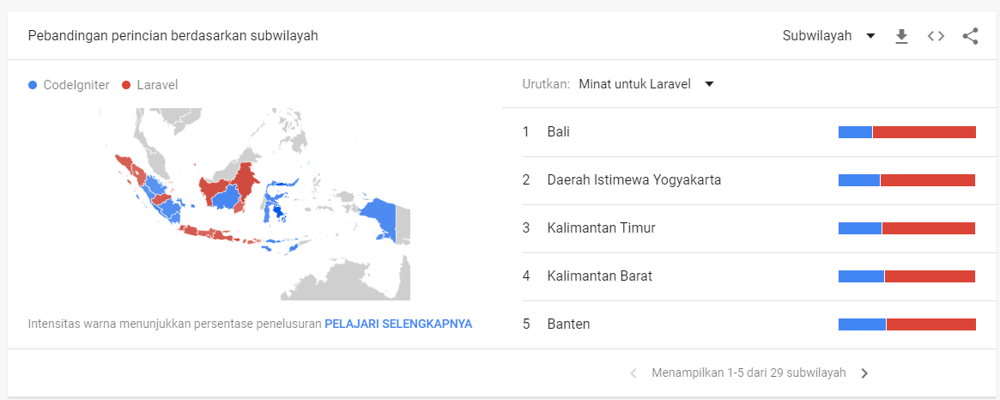

# Kenalan Pertama Larahati

Cerita tentang perjalanan @irfnrdh mengenal laravel lebih dalam. Jadi laravel pertama kenal udah lama 2018 lalu. Saat itu rasanya laravel ini kok aneh banget gitu kenapa dikit-dikit artisan terus kek gak berasa.&#x20;

Pengalaman saya belumnya lebih banyak develop dari dasar jadi dimulai dari dasar pindah ke oop terus databasenya juga pindah ke orm. Lalu berlanjut ke Codeigniter.&#x20;

Kayaknya CI itu nyaman karena bebas dan merasa mudah untuk dipahami.

Tapi ternyata laravel jauh lebih enak. Hal ini bukan karena waktu tentunya.\
Saya sendiri tidak ada mashab tertentu dalam dunia framework.

Asalkan dapat menyelesaikan masalah dan berkelanjutan, dah okehlah itu.

Alasan saya tidak menggunakan prosedural biasa adalah karena sisi keamanan dan sisi lemahnya ngoding tentu akan membuat banyak celah. Namun sebenarnya ini pondasi yang sangat baik. Orang yang sudah bisa dasar dia akan paham lebih baik tentang cara kerjanya dan tentu akan bisa menjawab "kenapa?" ini dan itu.

Pengalaman saya ketika belajar untuk membangun sebuah framework dari dasar sama seperti membangun linux from scratch membuat saya banyak berfikir dan prosesnya sangat mengasikkan. Kita mengetahui apa yang kita butuhkan dan membuat fungsi-fungsi yang akan difungsikan dengan baik dan efektif sesuai dengan tugas pokoknya.

2009 dan sekarang sudah 2022, beberapa tahun itu saya mengenal dunia teknologi lewat web.&#x20;

Ada hal yang unik dari laravel yakni "pengembangnya". Walaupun laravel dan beberapa framework php base dari symponik namun pengalaman sebagai artisannya membuat kita jadi lebih dekat.

Ketika belajar CI3 atau prosedural kita tak mengenal composer.

Tapi kehadiran laravel malah membuka sesuatu yang baru dengan manajemen pakage yang jauh lebih baik.&#x20;

Hal ini juga membuat saya belajar bagaimana taylor membangun kerajaannya. Laravel bukan hanya sekedar framework tapi lebih kepada sisi bisnis hal ini tentu membuat laravel jadi lebih baik dari pada pengembangan Codeigniter.&#x20;

Migrasi dari CI3 ke CI4 memakan waktu yang lama dan jauh berbeda dengan laravel yang bentar-bentar sudah berubah. Saya jadi ingat ketika saya dan teman saya membangun sebuah aplikasi web dan alasan dia memilih CI3 karena long-time update.

Satu sisi ini memang baik tapi dari sisi lain tentu akan jauh ketinggalan.&#x20;

Coba aja cek di google trend:&#x20;

{% embed url="https://trends.google.co.id/trends/explore?date=today+5-y&geo=ID&q=%2Fm%2F02qgdkj%2C%2Fm%2F0jwy148" %}
Trend antara Laravel vs CI di Indonesia


Mari kita lihat Screenshot dibawah ini

.png>)

### Apa yang membuat laravel naik? dan apa yang membuat Codeigniter turun?

itu menjadi pelajaran untuk kita sebagai pengembang, pembuat atau indiemaker bagaimana bisa membuat produk yang berdampak lebih baik.

Codeigniter dikembangkan lewat kampus sedang Laravel lewat otak seorang pengusaha digital.

Coba lihat dibawah ini. Laravel merupakan topik paling di cari di Bali, di pulau Jawa, kalimantan dan beberapa bagian di sumatera bagian utara termasuk Aceh tempat saya tinggal.

Sedangkan pencari codeigniter datang dari&#x20;

.png>)

Jadi singkatnya laravel itu mudah karena benar-benar dimudahkan dari pakage yang ada dan juga komunitas yang besar.

Untuk pengembagan ke arah SaaS, laravel enak dan sudah banyak bukti.

Oh ya laravel termasuk yang cepat update untuk integrasi ke teknologi yang lebih baru seperti penggunaan doker, integrasi ke teknologi front-end dan lainnya deh.

Untuk lainnya nanti akan diceritakan nanti...
